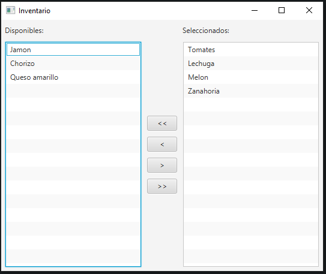

# Inventario
  Implementar una aplicación en Java con interfaz gráfica de usuario para movimientos de objetos entre dos listas.
 Usamos el framework JavaFX y un patrón de diseño MVC para implementar una interfaz que sea responsive.
 
 # Ventana principal
 Tenemos varios botones para mover los objetos entre los dos inventarios:

 

 * ">>" Nueve todos los objetos para la derecha
 * "<<" Nueve todos los objetos para la izquierda
 * "<" Nueve el objeto seleccionado a la tabla de la izquierda
 * ">" Nueve el objeto seleccionado a la tabla de la derecha
